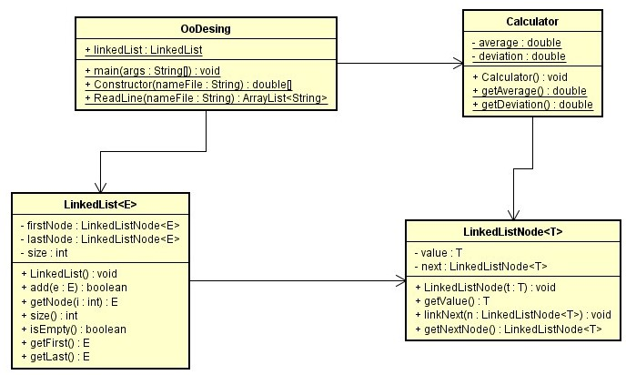
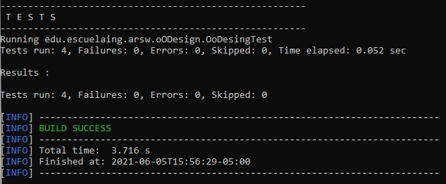

## OODesing
### Miguel Ángel Rodríguez Siachoque
### 5 de Junio de 2021

## Ejecución de OoDesing.java

Debe ser ejecutado de la siguiente manera: 
<ul>
  <li>La entrada es el nombreTexto.extension
  <li>La dirección del archivo tipo: Example1.txt y se ubican en la carpeta TestText en test.
</ul>

## Diagrama de Clases

<ul>
  <li>OoDesing
    

       Esta clase se encargada de obtener el nombre del archivo para poder generar los datos en Nodos para organizar la LinkedList, posteriormente mostrar la media y desviación con los datos obtenidos.
    <!p>
  <li>LinkedList<E>
    > 

       Esta clase generica se encarga de establecer las reglas basicas para poder generar una LinkedList donde se puede agregar,obtener los Nodos y longitud de esta LinkedList.
    <!p>
  <li>LinkedListNode<T>
    

      Esta clase se encarga de manejar al Nodo de la LinkedList, pues se puede obtener su posición, siguiente Nodo a este, valor que contiene y enlazar dicho nodo a su sucesor.
    <!p>
  <li>Calculator
    

      Esta clase se encarga de realizar los calculos de la media y desviacion, con los valores de los Nodos en la LinkedList. 
    <!p>
</ul>
<!p>

## Test

Se realizarón cuatro pruebas con mediante al comando: mvn test. 
En estos test se encuentra 3 testOk con los archivos en la carpeta test y un testNoOk.
<!p>

## JavaDoc:
[JavaDoc - OODesing](JavaDocs/index.html)

## Tiempo de Lineas LOC: 

 
El archvivo OoDesing.java: 
45 lineasLOC.  
El archvivo LinkedList.java: 
174 lineasLOC.  
El archvivo LinkedListNode.java: 
24 lineasLOC.  
El archvivo Calculator.java: 
35 lineasLOC.  
El archvivo OoDesingTest.java: 
43 lineasLOC.

### Tiempo total:

321/9 = 35.66 lineasLOC/horas.

